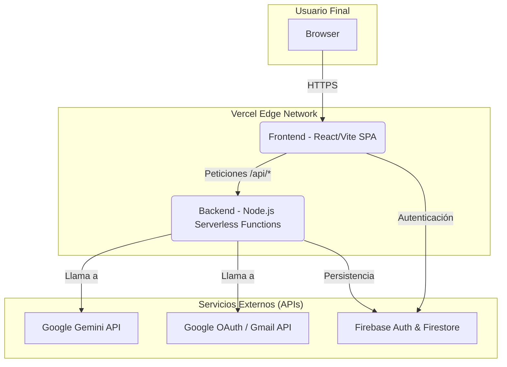

# Manual de Arquitectura y Operaciones — ConectaVacantes SaaS Pro

Este documento describe la arquitectura de producción, el flujo de datos, el despliegue y las operaciones de monitoreo para la plataforma **ConectaVacantes**.

---

## 1. Arquitectura de Producción en Vercel

El sistema utiliza una arquitectura híbrida que combina un frontend estático (SPA) con un backend serverless, todo desplegado en la plataforma Vercel para un rendimiento y escalabilidad óptimos.

### A. Diagrama de Arquitectura



### B. Componentes

1.  **Frontend (React/Vite en Vercel):**
    *   **Tecnología:** Aplicación de Página Única (SPA) construida con React y Vite.
    *   **Responsabilidad:** Renderiza la interfaz de usuario, gestiona el estado local y la interacción del usuario. Se encarga de la autenticación del lado del cliente con Firebase Auth.
    *   **Despliegue:** Se sirve como un conjunto de archivos estáticos (HTML, CSS, JS) a través de la red de distribución de contenido (CDN) de Vercel para una carga global ultrarrápida.

2.  **Backend (Funciones Serverless en Vercel):**
    *   **Tecnología:** Un servidor Express.js (`api/server.ts`) que Vercel convierte automáticamente en funciones serverless.
    *   **Responsabilidad:** Expone los endpoints de la API (`/api/*`) que centralizan la lógica de negocio. Se comunica de forma segura con servicios externos como la API de Gemini, protegiendo las claves de API.
    *   **Seguridad:** Implementa rate limiting, CORS y headers de seguridad para proteger los endpoints contra abusos.

3.  **Google Gemini API:**
    *   **Función:** Es el cerebro de la plataforma. Se utiliza para el análisis de CVs, el matching con vacantes, la generación de cartas de presentación y el chat de asesoría de carrera.

4.  **Firebase (Auth & Firestore):**
    *   **Función:** Provee la autenticación de usuarios (email/contraseña, Google) y la base de datos NoSQL (Firestore) para persistir los datos de los usuarios, perfiles y procesos de postulación.

---

## 2. Flujo de Despliegue y Configuración

El despliegue se gestiona automáticamente a través de la integración de Vercel con un repositorio de Git (GitHub, GitLab, etc.).

### A. Configuración de Vercel (`vercel.json`)

Este archivo es **crítico** para el correcto funcionamiento de la arquitectura híbrida.

```json
{
  "version": 2,
  "builds": [
    { "src": "api/server.ts", "use": "@vercel/node" },
    { "src": "package.json", "use": "@vercel/static-build", "config": { "distDir": "dist" } }
  ],
  "rewrites": [
    { "source": "/api/(.*)", "destination": "/api/server.ts" },
    { "source": "/(.*)", "destination": "/index.html" }
  ]
}
```
*   **`builds`**: Define cómo Vercel debe construir el proyecto. Una regla para la API (`@vercel/node`) y otra para el frontend (`@vercel/static-build`).
*   **`rewrites`**: Redirige el tráfico. Las peticiones a `/api/...` van a la función serverless, y todo lo demás se dirige al `index.html` del frontend para que el enrutador de React se haga cargo.

### B. Variables de Entorno

Las claves secretas deben configurarse en el panel de Vercel (Project Settings -> Environment Variables):
*   `GEMINI_API_KEY`: Clave para la API de Google Gemini.
*   `GOOGLE_CLIENT_ID`: Para la integración con Gmail.
*   `EMAIL_USER` / `EMAIL_PASS`: Credenciales para el envío de correos automáticos.
*   `VITE_FIREBASE_*`: Todas las claves de configuración de Firebase para el cliente.

---

## 3. API Endpoints y Monitoreo

### A. Endpoints Principales

*   `GET /api/health`: Endpoint de verificación de estado. Devuelve un JSON `{ "status": "healthy", ... }` si el servidor está operativo. Es ideal para monitoreo automatizado.
*   `POST /api/match-vacancies`: Recibe el CV y los criterios de búsqueda, y devuelve vacantes compatibles generadas por IA.
*   `POST /api/generate`: Genera textos (cartas, correos) personalizados a partir de un CV y una descripción de vacante.
*   `POST /api/chat`: Gestiona la conversación con el asesor de carrera de IA.

### B. Monitoreo y Verificación de Estado

Para confirmar que el backend está desplegado y respondiendo correctamente, puedes usar el siguiente comando de PowerShell o cURL:

**PowerShell:**
```powershell
Invoke-WebRequest -Uri 'https://<TU_DOMINIO_VERCEL>/api/health'
```

**cURL:**
```bash
curl https://<TU_DOMINIO_VERCEL>/api/health
```

**Resultado Esperado:**
```json
{
  "status": "healthy",
  "time": "2023-10-27T10:00:00.000Z"
}
```
Si recibes esta respuesta, significa que la configuración de Vercel es correcta y tus rutas de API están activas.

## 6. Buenas prácticas del sistema
- Mantener la lógica de negocio en el backend.
- Mantener el frontend enfocado en UI y estado local.
- Usar Firestore solo para datos persistentes y sensibles.
- Mantener fallback en caso de errores de IA.
